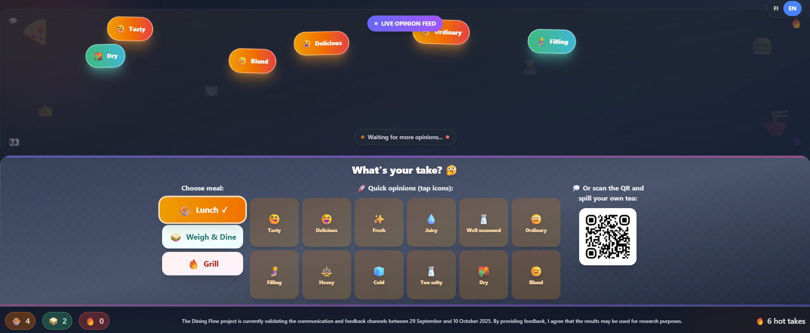

# Food Opinion Wall at Restaurant B



Food Opinion Wall is a real-time, touch-based opinion wall deployed in self-service restaurant settings as part of a research experiment on diner feedback. Visitors can rate their meal using emoji-driven quick opinions, which appear as animated floating bubbles on a large ambient LCD display. The system was designed to make giving feedback feel effortless and social — more like dropping a hot take than filling out a form. This folder of the code repository refers to the particular installation done at Restaurant B which has a slight deviation in meal type choices compared to Restaurant A.

Note: The original QR code in the screenshot and the repository has been replaced with a dummy QR code for security purposes.

---

## Overview

The application runs on two surfaces simultaneously:

- **Wall display** (large screen): Shows the animated opinion bubble cloud that grows and rearranges in real time as votes come in.
- **User device** (mobile layout): Shows the voting interface — meal type selection, quick-tap adjective buttons, and a free-text input field.

Both surfaces are served from the same URL. The layout switches automatically between mobile and desktop using Tailwind CSS responsive breakpoints (`lg:`).

---

## Technologies

| Technology | Purpose |
|---|---|
| [React 18](https://react.dev/) | UI framework |
| [TypeScript](https://www.typescriptlang.org/) | Type safety throughout |
| [Vite](https://vitejs.dev/) | Build tool and dev server |
| [Tailwind CSS](https://tailwindcss.com/) | Utility-first styling and responsive layout |
| [Lucide React](https://lucide.dev/) | Icon set |
| REST API (custom) | Vote submission and retrieval |

No database is bundled with the application. All persistence is handled by the external REST API.

---

## Customising the Adjectives

The preset opinion buttons are defined in **`src/utils/gossipData.ts`**:

```ts
const presets = [
  { text: t.tasty, emoji: "😋" },
  { text: t.delicious, emoji: "🤤" },
  { text: t.fresh, emoji: "✨" },
  // ... add or remove entries here
];
```

The `text` values reference translation keys. To add a new adjective:

1. Add the key to both `fi` and `en` objects in **`src/utils/translations.ts`**:
   ```ts
   // src/utils/translations.ts
   fi: { ..., crispy: "Rapea" },
   en: { ..., crispy: "Crispy" },
   ```

2. Add the Finnish → English mapping in **`src/utils/translationMapping.ts`** so votes submitted in either language are counted together:
   ```ts
   'Rapea': 'Crispy',
   'Crispy': 'Crispy',
   ```

3. Add the preset entry in **`src/utils/gossipData.ts`**:
   ```ts
   { text: t.crispy, emoji: "🥐" },
   ```

---

## API Configuration

All API settings live in **`src/utils/api.ts`**:

```ts
const API_BASE_URL = 'https://your-api-endpoint.example.com/study_id';
const AUTH_TOKEN = 'your-bearer-token-here';
```

### Expected API contract

**POST** — submit a vote:
```json
{
  "created": "2025-09-29T10:00:00.000Z",
  "studyid": "your-study-id",
  "votetarget": "lunch",
  "vote": "Tasty",
  "comment": null
}
```

**GET** — returns an array of the same shape. The app filters by `studyid` and today's date client-side.

The `studyid` field (currently `"restaurant-b"`) is used to namespace votes for a specific deployment or study cohort. Change it in `api.ts` to isolate your data:

```ts
studyid: 'your-study-id',
```
---

## Seed / Fallback Votes

In **`src/hooks/useGossipBubbles.ts`**, a small set of fake votes is always added (`+1`) on top of real API data. This ensures the wall is never blank on first load and gives the word cloud a baseline shape. To remove or change these, find the `fakeVotes` array inside `loadApiVotes()`:

```ts
const fakeVotes = [
  { canonical: 'Tasty', mealType: 'lunch', emoji: '😋' },
  // ...
];
```
The preset votes do not call the API and therefore is only a cosmetic change at UI level. 

---

## Language Behaviour

- The interface supports **Finnish** (`fi`) and **English** (`en`), toggled via the button in the top-right corner.
- After **1 minute of inactivity**, the language automatically resets to Finnish. This is intentional for a shared kiosk context and the dominant language of the audience being Finnish speakers.
- The wall display translates bubble labels dynamically based on the current language without re-fetching data.

---

## Running Locally

```bash
npm install
npm run dev
```

The app will be available at `localhost`.

To build for production:

```bash
npm run build
npm run preview
```

---

## Deployment

The project is a fully static front-end application and can be hosted on your preferred static hosting provider.

---

## Acknowledgement
This research was supported by Business Finland, under the Veturi program with the Dining Flow project (6547/31/2022). We acknowledge the Flavoria Research Platform, Antell and our colleagues at University of Turku for their continued support and contributions to the study. More about the Dining Flow project at University of Turku [here](https://sites.utu.fi/diningflow/).
